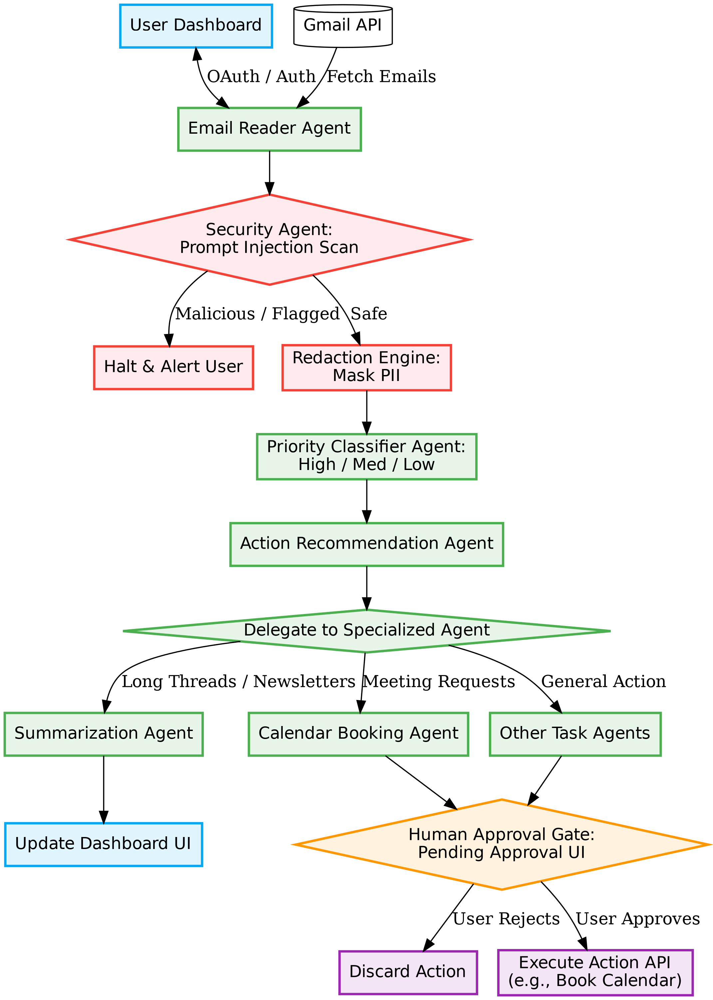

# Secure Ambient Multi-Agent Productivity Assistant

A privacy-first multi-agent email productivity assistant that helps users manage inbox overload safely by combining Gmail ingestion, prompt injection detection, sensitive data redaction, email classification, task routing, calendar support, daily summaries, and human approval for sensitive actions. 

---

## Kaggle Submission Information

- **Selected Track:** Concierge Agents
- **Project Type:** AI Agents Capstone project for Kaggle
- **Video Demo:** [https://youtu.be/IgLTtk8M3sM](https://youtu.be/IgLTtk8M3sM)
- **GitHub Repository:** [https://github.com/jujytsukaisen/secure-ambient-multi-agent.git](https://github.com/jujytsukaisen/secure-ambient-multi-agent.git)

---

## Team Members

- Mustafa Muhammed
- Tuamah Mahmood
- Nooruldeen Hayder

---

## Overview

The **Secure Ambient Multi-Agent Productivity Assistant** is an intelligent email management system designed to reduce inbox overload while prioritizing privacy, security, and user control. It helps users process incoming emails, identify important messages, route meeting requests, create tasks, and generate daily summaries.

Unlike traditional email assistants that may treat all incoming content as trusted, this project uses a security-first workflow. Email content is treated as external and untrusted input. Before the assistant performs classification, planning, or action routing, the content is checked for prompt injection attempts and sensitive information is redacted.

The system is built around a modular multi-agent architecture. Each agent has a focused responsibility, such as planning, filtering emails, handling calendar requests, summarizing tasks, or applying security checks. Sensitive actions are placed behind a **Human Approval Gate**, ensuring the user remains in control.

---

## Problem Statement

Modern users receive many emails every day, including urgent requests, meeting invitations, reminders, newsletters, personal messages, and low-priority updates. Manually reading, sorting, and deciding what to do with each message wastes time and increases cognitive load.

Traditional email filters can detect spam or apply simple labels, but they do not fully understand urgency, intent, scheduling needs, or action requirements.

AI assistants can help, but they introduce new safety risks. Emails are untrusted inputs and may contain prompt injection attempts, requests to bypass safety rules, instructions to reveal hidden prompts, sensitive personal information, phone numbers, email addresses, or API-key-like strings.

A safe AI email assistant must therefore combine productivity automation with explicit security controls.

---

## Proposed Solution

Our solution is a **Secure Ambient Multi-Agent Productivity Assistant** that processes email through a controlled, security-first multi-agent workflow.

The assistant:

1. Ingests emails through a Gmail/OAuth workflow.
2. Passes incoming email content through a Security Agent.
3. Detects prompt injection attempts and unsafe instructions.
4. Redacts sensitive information before downstream processing.
5. Classifies emails by intent and priority.
6. Routes meeting-related messages to a Calendar Booking Agent.
7. Creates tasks for urgent or reply-needed emails.
8. Generates a daily task summary.
9. Requires human approval before sensitive actions are completed.

This creates a practical balance between automation, safety, privacy, and user control.

---

## Key Features

- Gmail/OAuth email ingestion
- Security-first email processing
- Prompt injection detection
- Sensitive data redaction
- Email classification
- Task creation
- Calendar booking support
- Daily summary generation
- Human Approval Gate for sensitive actions
- React/Vite frontend dashboard
- Python backend agents
- Modular tools for email, calendar, and tasks

---

## Multi-Agent Architecture

The backend is organized as a Python-based multi-agent workflow. The system uses specialized agents and modules with clear responsibilities.

### 1. Security Agent / Security Layer

**File paths:**

- `app/security/prompt_injection.py`
- `app/security/redaction.py`
- `app/security/approval.py`
- `app/security/schemas.py`

**Purpose:** Acts as the first security layer that protects downstream agents from unsafe or sensitive email content.

**Main responsibilities:**

- Detect prompt injection attempts
- Detect unsafe instructions
- Redact sensitive data
- Support approval logic for sensitive actions

### 2. Planner Agent

**File path:** `app/agents/planner_agent.py`

**Purpose:** Acts as the main coordinator of the backend workflow.

**Main responsibilities:**

- Checks unread emails
- Routes emails to the Email Filter Agent
- Coordinates sub-agent work
- Triggers the end-of-day summary

### 3. Email Filter Agent

**File path:** `app/agents/email_filter_agent.py`

**Purpose:** Classifies incoming emails and routes them to the correct workflow.

**Main responsibilities:**

- Classifies emails as important, meeting request, needs reply, spam, or low priority
- Creates tasks for urgent emails
- Creates reply tasks for messages that need responses
- Routes meeting-related emails to the Calendar Booking Agent

### 4. Calendar Booking Agent

**File path:** `app/agents/calendar_booking_agent.py`

**Purpose:** Handles scheduling and meeting-related emails.

**Main responsibilities:**

- Detects meeting requests
- Suggests available calendar slots
- Attempts booking through calendar tools
- Creates pending approval tasks when confirmation is needed

### 5. Daily Summary Agent

**File path:** `app/agents/daily_summary_agent.py`

**Purpose:** Generates a concise report of recorded tasks and email-driven actions.

**Main responsibilities:**

- Reads all recorded tasks
- Summarizes daily productivity activity
- Provides an end-of-day summary for the user

---

## Security-First Workflow

A key design principle is that the **Security Agent is the first processing layer after email ingestion**. Emails are treated as untrusted input and are checked before deeper classification, planning, summarization, or action execution.

```text
Gmail API / Email Ingestion
        ↓
Security Agent
        ↓
Redaction Engine
        ↓
Email Filter Agent
        ↓
Planner Agent
        ↓
Calendar Booking Agent / Daily Summary Agent
        ↓
Human Approval Gate
        ↓
Final Action or Summary
```

This workflow reduces the risk of malicious email content influencing the assistant.

---

## Architecture Diagram

The architecture diagram below shows the security-first multi-agent workflow. Incoming Gmail messages pass through the Security Agent and Redaction Engine before reaching classification, planning, calendar handling, summary generation, or approval-based actions.



*Figure 1. Overall architecture of the Secure Ambient Multi-Agent Productivity Assistant.*

## Project Structure

```text
secure-ambient-multi-agent/
│
├── secure-productivity-assistant/
│   ├── .agents/
│   ├── .semgrep/
│   ├── app/
│   │   ├── agents/
│   │   │   ├── planner_agent.py
│   │   │   ├── email_filter_agent.py
│   │   │   ├── calendar_booking_agent.py
│   │   │   └── daily_summary_agent.py
│   │   │
│   │   ├── security/
│   │   │   ├── prompt_injection.py
│   │   │   ├── redaction.py
│   │   │   ├── approval.py
│   │   │   └── schemas.py
│   │   │
│   │   └── tools/
│   │       ├── email_tools.py
│   │       ├── calendar_tools.py
│   │       └── task_tools.py
│   │
│   ├── data/
│   ├── tests/
│   ├── GOOGLE_CLOUD_DEPLOYMENT.md
│   ├── STRIDE.md
│   ├── TDD_PLAN.md
│   ├── README.md
│   └── pyproject.toml
│
├── src/
│   ├── lib/
│   │   ├── firebaseAuth.ts
│   │   ├── gmailService.ts
│   │   └── workspaceService.ts
│   ├── App.tsx
│   ├── index.css
│   └── main.tsx
│
├── .env.example
├── README.md
├── firebase-applet-config.json
├── index.html
├── metadata.json
├── package.json
├── package-lock.json
├── server.ts
├── tsconfig.json
└── vite.config.ts
```
---

## Technical Implementation

The project uses a frontend-backend architecture.

### Frontend

The frontend is built with **React/Vite** and provides the user-facing dashboard.

Frontend responsibilities include:

- Google OAuth authentication
- Gmail access through frontend services
- Email review interface
- Agent status display
- Security status monitoring
- Pending approval states
- Dashboard statistics
- User interaction and approval decisions

Important frontend files:

- `src/App.tsx`
- `src/main.tsx`
- `src/lib/firebaseAuth.ts`
- `src/lib/gmailService.ts`
- `src/lib/workspaceService.ts`

### Backend

The backend is built with **Python** and contains the multi-agent workflow.

Backend responsibilities include:

- Email ingestion
- Security scanning
- Prompt injection detection
- Sensitive data redaction
- Email classification
- Calendar-related processing
- Task creation
- Daily summary generation
- Approval logic

Important backend folders:

- `app/agents/`
- `app/security/`
- `app/tools/`

---

## Security Features

Security is central to this project.

### Prompt Injection Detection

The Security Layer detects suspicious phrases and unsafe instructions, including attempts to:

- Ignore previous instructions
- Reveal system prompts
- Run commands
- Bypass approval
- Disable security
- Delete data
- Use destructive command patterns such as `rm -rf`

Relevant file:

```text
app/security/prompt_injection.py
```

### Sensitive Data Redaction

The Redaction Engine masks sensitive information before downstream processing.

It redacts:

- Email addresses
- Phone numbers
- API-key-like strings

Relevant file:

```text
app/security/redaction.py
```

### Human Approval Gate

The Human Approval Gate prevents sensitive actions from being executed silently. For example, calendar booking actions can be placed in a pending approval state until the user confirms the action.

Relevant file:

```text
app/security/approval.py
```

---

## Agent Tools

The project includes tool modules that provide capabilities to the agents.

### Email Tools

**File:** `app/tools/email_tools.py`

**Purpose:**

- Retrieves unread emails
- Packages email data into schemas
- Supports the email ingestion workflow

### Calendar Tools

**File:** `app/tools/calendar_tools.py`

**Purpose:**

- Retrieves available calendar slots
- Supports meeting booking
- Uses approval logic for sensitive scheduling actions

### Task Tools

**File:** `app/tools/task_tools.py`

**Purpose:**

- Adds tasks
- Retrieves all tasks
- Supports daily summaries and action tracking

---

## Setup Instructions

### Prerequisites

Make sure you have:

- Python 3.8 or newer
- Node.js and npm
- A Google Cloud project with Gmail API enabled
- Firebase project configuration for authentication
- Required environment variables

### 1. Clone the Repository

```bash
git clone https://github.com/jujytsukaisen/secure-ambient-multi-agent.git
cd secure-ambient-multi-agent
```

### 2. Backend Setup

Create and activate a virtual environment:

```bash
python -m venv .venv
```

On Windows:

```bash
.venv\Scripts\activate
```

On macOS/Linux:

```bash
source .venv/bin/activate
```

Install backend dependencies:

```bash
pip install -r requirements.txt
```

Run the backend or main Python entry point:

```bash
python main.py
```

If your backend entry point uses a different file, adjust the command based on your project structure.

### 3. Frontend Setup

Install frontend dependencies:

```bash
npm install
```

Run the Vite development server:

```bash
npm run dev
```

Open the local development URL shown in the terminal.

---

## Environment Variables

Create a `.env` file or frontend environment file based on your setup.

Example variables to verify based on your configuration:

```env
VITE_FIREBASE_API_KEY=your_firebase_api_key
VITE_FIREBASE_AUTH_DOMAIN=your_project.firebaseapp.com
VITE_FIREBASE_PROJECT_ID=your_firebase_project_id
VITE_GOOGLE_CLIENT_ID=your_google_client_id

GOOGLE_CLIENT_SECRET=your_google_client_secret
GMAIL_API_KEY=your_gmail_api_key
```

Also consider creating a `.env.example` file so users can configure the project safely without exposing private keys.

---

## Usage

1. Open the React/Vite dashboard.
2. Authenticate using Google OAuth.
3. Allow the assistant to fetch or scan Gmail messages.
4. Incoming emails pass through the Security Agent.
5. Unsafe emails are flagged or blocked.
6. Safe emails are redacted and classified.
7. Urgent or reply-needed emails are converted into tasks.
8. Meeting-related emails are routed to the Calendar Booking Agent.
9. Sensitive actions are held behind the Human Approval Gate.
10. The Daily Summary Agent generates a concise report of recorded tasks.

---

## Course Concepts Applied

| Course Concept | Status | Evidence in Project |
|---|---|---|
| Multi-agent system | Implemented | Planner Agent, Email Filter Agent, Calendar Booking Agent, Daily Summary Agent, and Security Layer |
| Agent tools / skills | Implemented | Email tools, calendar tools, and task tools |
| Security features | Implemented | Prompt injection detection, sensitive data redaction, and approval logic |
| Human-in-the-loop approval | Implemented | Pending approval workflow for sensitive actions |
| Gmail / Google Workspace integration | Implemented | OAuth and Gmail service integration |
| Frontend dashboard | Implemented | React/Vite dashboard for authentication, monitoring, and approvals |
| Deployability | Partial / Future Work | GitHub repository and demo are available; standalone cloud deployment is planned |
| MCP Server | Future Work | Planned for standardized external tool integration |

---

## Demo

**Video Demo:** [https://youtu.be/IgLTtk8M3sM](https://youtu.be/IgLTtk8M3sM)

The demo shows:

- Dashboard overview
- Email processing workflow
- Prompt injection detection
- Sensitive data redaction
- Email classification
- Calendar/task routing
- Human Approval Gate

---

## Project Impact

The Secure Ambient Multi-Agent Productivity Assistant helps reduce inbox overload and allows users to focus on important messages first. By classifying emails, identifying meeting requests, creating tasks, and generating summaries, the system saves time and reduces the effort required to manage daily communication.

The project also improves trust in AI-assisted productivity tools by combining automation with prompt injection detection, sensitive data redaction, and approval-based action handling.

Overall, the project impact is a safer and more efficient email workflow that combines productivity automation, privacy protection, and user control.

---

## Future Work

- Add a Model Context Protocol (MCP) Server for standardized tool integration.
- Deploy the full system as a standalone cloud application.
- Add real-time Gmail push notifications for immediate email processing.
- Expand the Human Approval Gate for more action types.
- Improve email prioritization using more advanced AI-based classification.
- Add richer dashboard analytics and activity logs.
- Add more external productivity integrations.

---

## Final Statement

The Secure Ambient Multi-Agent Productivity Assistant combines productivity automation with a security-first multi-agent design. It shows how AI agents can help users manage email overload while protecting privacy, detecting unsafe instructions, routing tasks to specialized agents, and keeping the user in control.
